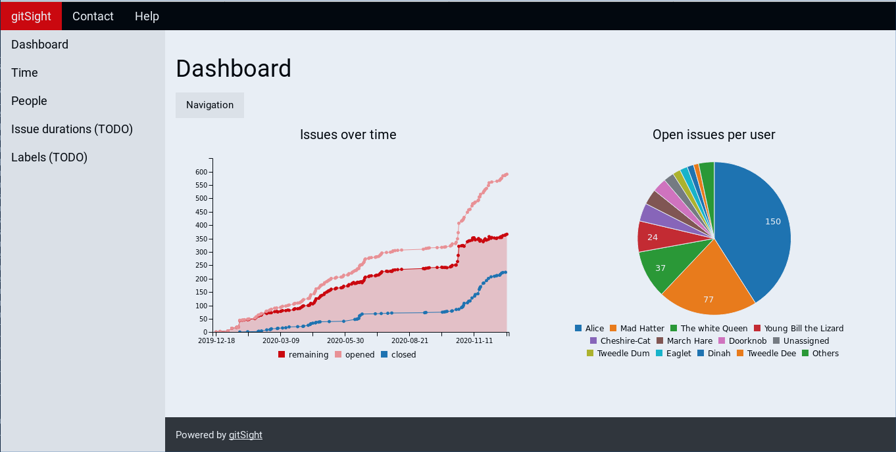
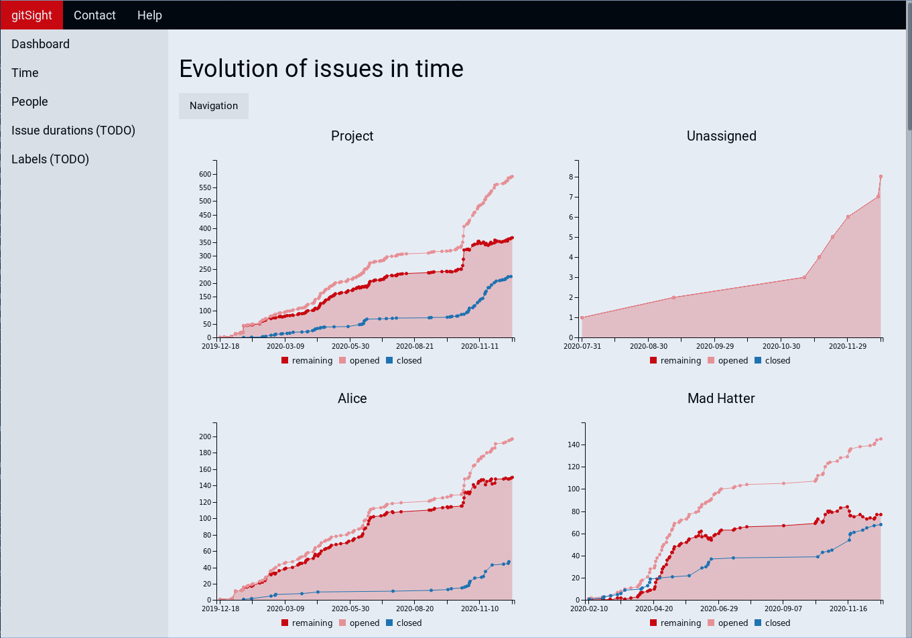

The initial goal of this project is to be able to visualize git issue statistiscs for gitlab projects.

It uses [python-gitlab](https://github.com/python-gitlab/python-gitlab) to retreive data from your gitlab project, and [c3js](https://c3js.org/) for plotting.

We are only getting started, there is much more to come...

# installation

For now the code isn't nicely packaged yet. Install by 
- downloading the repo
- making sure you have the packages in requirements.txt, these are the versions that have been tested. Since we use very basic functionality, earlier versions are very likely to work as well
- set the required environment variables:
  - create the environment variable '$GITSIGHT_HOME' and set it to the main repo path
  - set the correct PYTHONPATH to '$GITSIGHT_HOME'
  - add gitSight's bin directory to your path 
  
 ```
 # bash example
 export GITSIGHT_HOME=<your_specific_path>/gitSight
 export PYTHONPATH=$GITSIGHT_HOME:$PYTHONPATH
 export PATH=$GITSIGHT_HOME/bin:$PATH
 ```


# configuration

## command line

```
usage: gitsight [-h] [-c CONFIG]

Create different kind of charts from a gitlab project

optional arguments:
  -h, --help            show this help message and exit
  -c CONFIG, --config CONFIG
                        gitsight yaml config file to use (default:
                        gitsight.yaml)

```

## main YAML configuration file 

This is the file passed via the -c/--config command line option. It is the main configuration file for the tool and is written in [YAML](https://yaml.org/) syntax. This is explained by the example below.

```
---
# settings related to https://github.com/python-gitlab/python-gitlab
gitlab:
  config_file: ~/.python-gitlab.cfg
  config_file_section: gitlab public
  project_id: 19719852

# page related settings
pages:
  dashboard:
    columns: 2
  time:
    columns: 2
  people:
    columns: 1
...
```

The gitlab section relates to python-gitlab, see also the following section 'python-gitlab configuration file'.
- gitlab.config_file: the path to the python-gitlab config file
- config_file_section: the section in that config file to use
- project_id: the project ID of the project you want to let this tool run on. You can find this in gitlab's web interface -> Project overview

The pages section has some setting that alter how each of the pages get generated.
- columns: sets how many columns to use for the page

## python-gitlab configuration file

Because we use [python-gitlab](https://github.com/python-gitlab/python-gitlab) to access the git database, we also need to have a configuration for this tool. This file should match with the 'gitlab.config_file' and 'gitlab.config_file_section' if the 'main YAML configuration file'. See the documentation of [python-gitlab](https://github.com/python-gitlab/python-gitlab) for possible options, but you can start with the following example, matching the YAML configuration file example:

```
[gitlab public]
url = https://gitlab.com
ssl_verify = true
timeout = 5
private_token = <here you need to fill in your private gitlab token - without the brackets>
api_version = 4
```

See the gitlab documentation on how to create your private_token.


# example output





